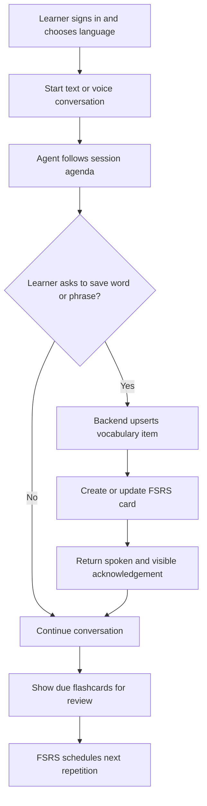

# Langy — core business flow: voice lesson and vocabulary review

```mermaid
flowchart TD
  A[Learner signs in and chooses language] --> B[Start text or voice conversation]
  B --> C[Agent follows session agenda]
  C --> D{Learner asks to save word or phrase?}
  D -- No --> E[Continue conversation]
  D -- Yes --> F[Backend upserts vocabulary item]
  F --> G[Create or update FSRS card]
  G --> H[Return spoken and visible acknowledgement]
  H --> E
  E --> I[Show due flashcards for review]
  I --> J[FSRS schedules next repetition]
```

The default voice path uses Gemini Live; Render owns the authenticated tool call, persistence and spend checks.
