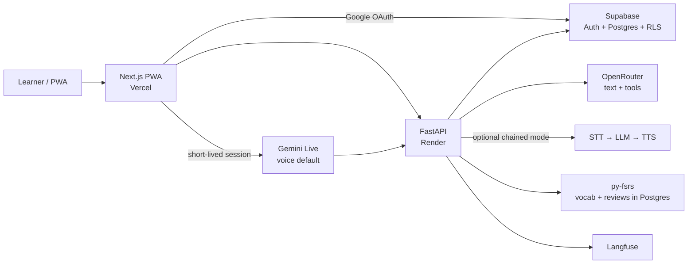

# Langy — current architecture

```mermaid
flowchart LR
  L[Learner / PWA] --> FE[Next.js PWA\nVercel]
  FE -->|Google OAuth| SB[Supabase\nAuth + Postgres + RLS]
  FE --> API[FastAPI\nRender]
  API --> SB
  API --> OR[OpenRouter\ntext + tools]
  FE -->|short-lived session| GL[Gemini Live\nvoice default]
  GL --> API
  API -->|optional chained mode| STT[STT → LLM → TTS]
  API --> FSRS[py-fsrs\nvocab + reviews in Postgres]
  API --> LF[Langfuse]
```

Voice defaults to browser-to-Live media with Render handling auth, tools, persistence and spend checks. Postgres stores FSRS and jobs; no Redis in MVP.
