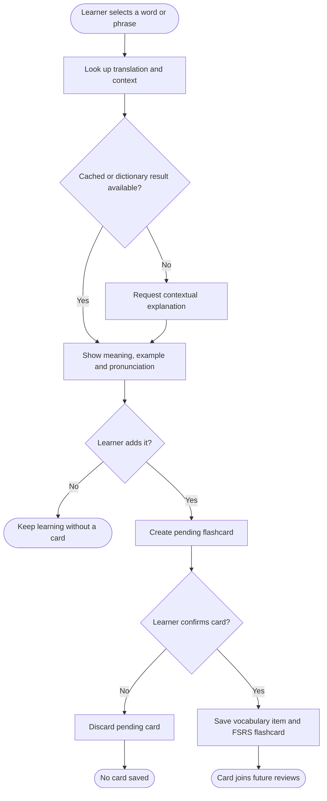

# Langy — business flow: transcript selection to flashcard

```mermaid
flowchart TD
    start([Learner selects a word or phrase]) --> lookup[Look up translation and context]
    lookup --> available{Cached or dictionary result available?}
    available -- No --> enrich[Request contextual explanation]
    available -- Yes --> preview[Show meaning, example and pronunciation]
    enrich --> preview
    preview --> add{Learner adds it?}
    add -- No --> end1([Keep learning without a card])
    add -- Yes --> pending[Create pending flashcard]
    pending --> confirm{Learner confirms card?}
    confirm -- No --> discard[Discard pending card]
    confirm -- Yes --> card[Save vocabulary item and FSRS flashcard]
    discard --> end2([No card saved])
    card --> end3([Card joins future reviews])
```
